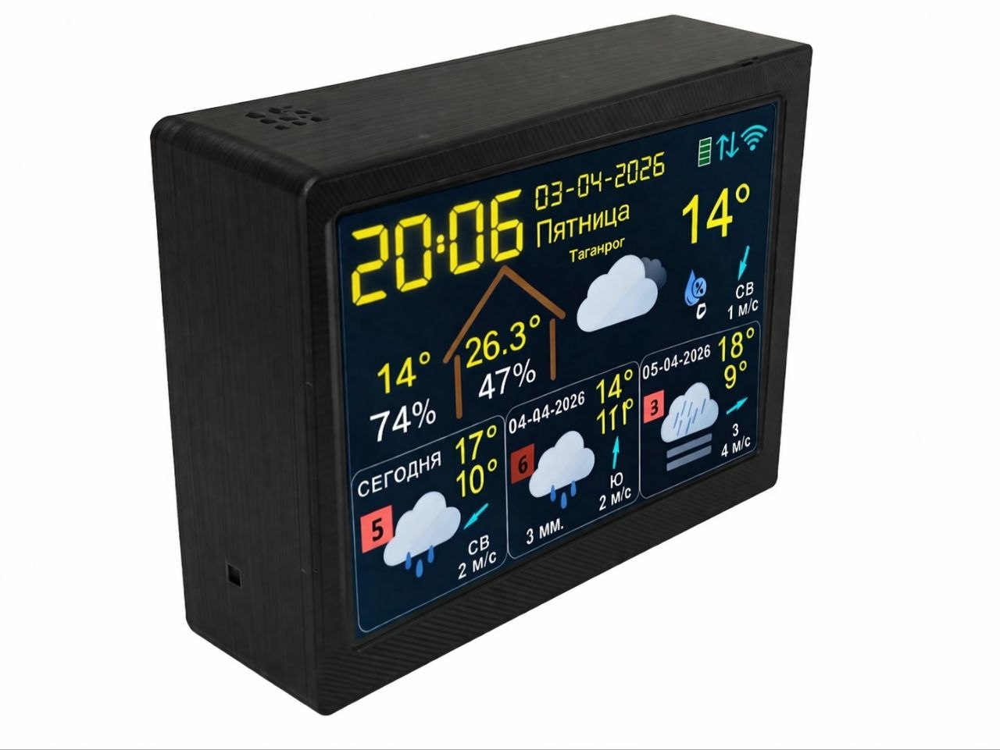
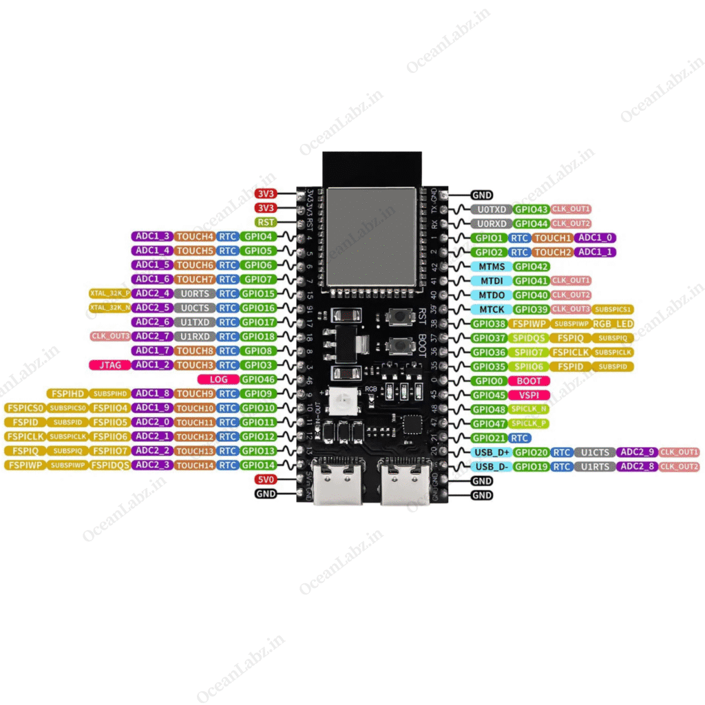
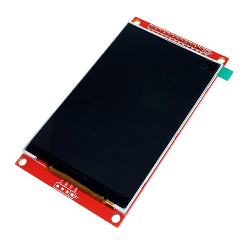
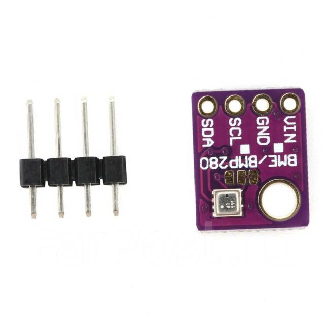
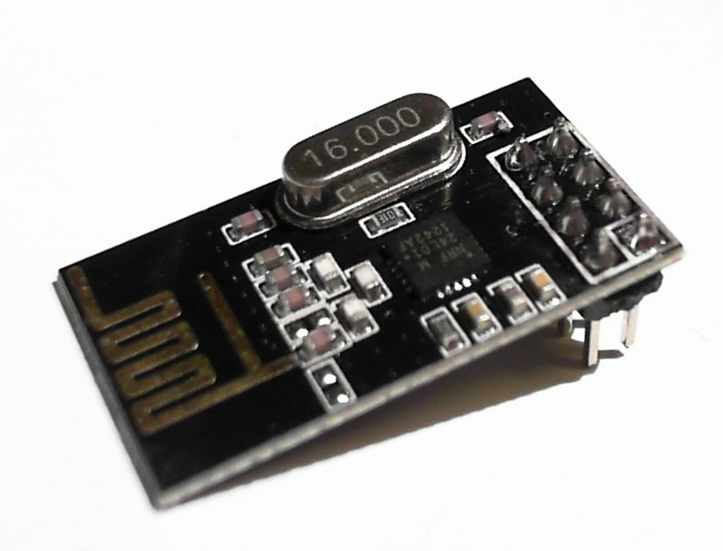

# meteo_station

ESP32-S3 Weather Station with TFT Display

## Описание

Проект представляет собой метеостанцию на базе ESP32-S3 с цветным TFT-дисплеем 480x320. Устройство отображает текущую погоду, прогноз на 3 дня, данные внутреннего и внешнего датчиков, геомагнитную обстановку, а также передаёт данные в MQTT и NarodMon.

## Аппаратные требования

- **Плата**: ESP32-S3-DevKitC-1 (16MB Flash, 8MB PSRAM)
- **Дисплей**: TFT ILI9488 480x320 (SPI) 4"
- **Внутренний датчик**: BME280 (I2C: 0x76/0x77)
- **Внешний приёмник**: nRF24L01+ (SPI)
- **Файловая система**: LittleFS

## Аппаратные компоненты

### Фотография метеостанции в сборе



### Фотографии отдельных компонентов

**ESP32-S3-DevKitC-1**


**TFT ILI9488 480x320 4"**


**Датчик BME280**


**Модуль nRF24L01+**


### Схема подключения

Схема подключения компонентов доступна в следующих файлах:

- **Fritzing схема**: упрощенная схема [etc/fritzing_scheme.fzz](etc/fritzing_scheme.fzz)
- **EasyEDA проект**: [etc/meteo_station_main.eprj](etc/meteo_station_main.eprj)

## Функциональные возможности

### Отображение данных

- Цифровые часы с датой (шрифт DSEG7)
- Текущая погода: температура, влажность, ветер, иконка погоды
- Прогноз на 3 дня: мин/макс температура, осадки, ветер, геомагнитный индекс Kp
- Данные внутреннего датчика (BME280): температура, влажность, давление
- Данные внешнего датчика (nRF24L01+): температура, влажность, давление, заряд батареи
- Индикатор состояния WiFi и MQTT подключения
- Название населённого пункта (геокодирование)

### Сетевые функции

- Подключение к WiFi через WiFiManager
- Веб-портал конфигурации параметров
- Получение данных погоды от Open-Meteo API
- Геокодирование координат в название населённого пункта (Nominatim)
- Отправка данных в MQTT брокер
- Отправка данных на NarodMon
- Синхронизация времени по NTP
- Обновление прошивки по OTA

### Датчики

- **Внутренний**: BME280 (температура, влажность, давление)
- **Внешний**: ESP32-C6 + SHTC3 + nRF24L01+ (требуется отдельный проект `meteo_station_out_sensor`)

## Конфигурация

### Параметры веб-портала

| Параметр | Описание | По умолчанию |
|----------|----------|--------------|
| MQTT Server | Адрес MQTT брокера | srv2.clusterfly.ru |
| MQTT Port | Порт MQTT брокера | 9991 |
| MQTT User | Имя пользователя MQTT | - |
| MQTT Pass | Пароль MQTT | - |
| MQTT Prefix | Префикс топиков | meteo_station |
| Latitude | Широта для Open-Meteo | 55.7522 |
| Longitude | Долгота для Open-Meteo | 37.6155 |
| GMT Offset | Смещение часового пояса (сек) | 10800 |

### Вывод MQTT топиков

Топики формируются по шаблону: `{mqtt_user}/{mqtt_prefix}/<тип_датчика>`

**Внутренний датчик (BME280):**
```
{mqtt_user}/{mqtt_prefix}/in
```
JSON payload:
```json
{
  "t": 22.5,   // температура внутри (°C)
  "p": 1013,   // давление внутри (hPa)
  "h": 45      // влажность внутри (%)
}
```

**Внешний датчик (nRF24L01+):**
```
{mqtt_user}/{mqtt_prefix}/out
```
JSON payload:
```json
{
  "t": -5.2,   // температура снаружи (°C)
  "p": 1015,   // давление снаружи (hPa)
  "h": 65,     // влажность снаружи (%)
  "bat": 87    // заряд батареи (%)
}
```

## Сборка и прошивка

### Требования

- PlatformIO Core или PlatformIO IDE
- ESP32-S3 совместимый программатор

### Сборка

```bash
pio run
```

### Прошивка

```bash
pio run --target upload
```

### Монитор последовательного порта

```bash
pio device monitor
```

## Структура проекта

```
meteo_station/
├── include/              # Заголовочные файлы
│   ├── common.h          # Общие определения и структуры
│   ├── meteowidgets.h    # Класс виджетов погоды
│   ├── openmeteo.h       # Класс работы с Open-Meteo API
│   ├── mqttsender.h      # Класс отправки в MQTT
│   ├── webportal.h       # Класс веб-конфигурации
│   └── task_*.h          # Заголовочные файлы задач
├── src/                  # Исходные коды
│   ├── main.cpp          # Точка входа
│   ├── meteowidgets.cpp  # Реализация виджетов
│   ├── openmeteo.cpp     # Реализация Open-Meteo
│   ├── mqttsender.cpp    # Реализация MQTT
│   ├── webportal.cpp     # Реализация веб-конфигурации
│   └── task_*.cpp        # Реализация задач FreeRTOS
├── data/                 # Файлы для LittleFS
│   ├── *.vlw             # Шрифты
│   └── icons/            # PNG иконки погоды
├── platformio.ini        # Конфигурация PlatformIO
└── partitions.csv        # Таблица разделов
```

## Используемые библиотеки

- [TFT_eSPI](https://github.com/Bodmer/TFT_eSPI) - работа с TFT дисплеем
- [LovyanGFX](https://github.com/lovyan03/LovyanGFX) - расширенная поддержка дисплеев
- [WiFiManager](https://github.com/tzapu/WiFiManager) - управление WiFi
- [PNGdec](https://github.com/bitbank2/PNGdec) - декодирование PNG
- [ArduinoJson](https://github.com/bblanchon/ArduinoJson) - парсинг JSON
- [Adafruit BME280](https://github.com/adafruit/Adafruit_BME280_Library) - датчик BME280
- [RF24](https://github.com/nRF24/RF24) - радиомодуль nRF24L01+
- [PubSubClient](https://github.com/knolleary/PubSubClient) - MQTT клиент
- [esp32FOTA](https://github.com/chrisjoyce911/esp32FOTA) - OTA обновления

## Внешний датчик

Для работы с внешним датчиком используется отдельный проект [meteo_station_out_sensor](../meteo_station_out_sensor/), который передаёт данные по nRF24L01+.

## Лицензия

MIT License
